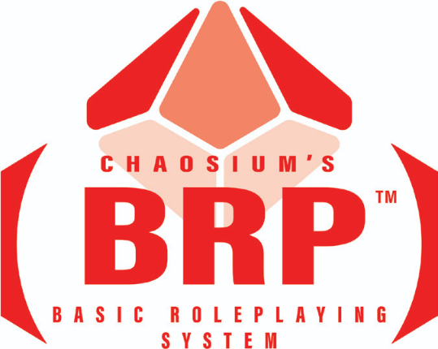

# 2D6 MCP — AI GM Assistant

SPDX-License-Identifier: AGPL-3.0-only
Copyright (C) 2026 Jupiter Industries (Liam Crowter) and the 2d6mcp maintainers

A system-agnostic Model Context Protocol (MCP) server and hosted Cloudflare Worker providing a mechanical engine, dice roller, rules reference, and AI-powered rulings assistant for tabletop RPGs. Supports sci-fi (OGL/Cepheus Engine SRD), fantasy (Dungeon World, CC-BY-3.0), generic percentile (Basic Roleplaying SRD, BRP OGL v1.0), and d20 fantasy (5E-compatible SRD, CC-BY-4.0) games.

## Deployment Modes

| Mode | Description | Cost |
|---|---|---|
| **Self-Hosted MCP Server** | Run locally on your machine. Full BYOD support, MLX-powered audio transcription and ruling synthesis (macOS). Works in any AI harness (Claude, Kilo, Cursor, etc.) | Free (AGPL-3.0) |
| **Hosted Discord Bot** | Deploy to Cloudflare Workers. Discord slash commands, Workers AI-powered rulings (Qwen3 MoE), web dashboard. Zero local setup beyond wrangler. | Free (self-deploy) / $5/mo (managed) |

## Features

- **Dice Engine** — `2d6+1`, `3d6`, `d66`, target numbers, effect margins
- **OGL Rules Database** — Generated on first use from bundled seed data: Cepheus Engine SRD (OGL v1.0a)
- **Dungeon World Database** — Generated on first use from bundled seed data: moves, classes, spells, monsters, GM tools (CC-BY-3.0)
- **Basic Roleplaying Database** — Generated on first use from bundled seed data: BRP SRD 1.0.2 characteristics, skills, professions, weapons, armor, spot rules (BRP OGL v1.0)
- **5E-Compatible Database** — Generated on first use from bundled seed data: d20 fantasy SRD classes, spells, monsters, feats, and rules (CC-BY-4.0)
- **AI Rulings** — Ask rules questions, get cited answers from OGL/DW/BRP/5E-compatible/BYOD sources. Powered by Qwen3 MoE (Cloudflare) or MLX LLM (self-hosted)
- **Discord Bot** — Slash commands (`/ask`, `/roll`, `/session`) in your TTRPG server. Real-time rulings with source citations
- **BYOD Indexing** — Ingest your own PDF/text/markdown files for local full-text search (self-hosted only)
- **Session Management** — Start/end sessions, log transcripts, search what was said at the table
- **Cross-Platform AI** — Cloudflare Workers AI (Whisper + LLM) works on any device, no GPU needed

## Quick Start — Self-Hosted MCP Server

```bash
git clone https://github.com/crowterliam/2d6mcp.git
cd 2d6mcp
npm install
npm run build
npm run setup          # create consent token for BYOD mode
npm run populate-ogl   # generate the OGL rules database
npm run populate-dw    # generate the Dungeon World rules database
npm run populate-brp   # generate the Basic Roleplaying rules database
npm run populate-5ecompatible  # generate the 5E-compatible rules database
npm run start          # run the MCP server (stdio transport)
```

## Quick Start — Hosted Discord Bot (Cloudflare)

```bash
git clone https://github.com/crowterliam/2d6mcp.git
cd 2d6mcp
npm install
npm run setup-cloud
```

The interactive wizard guides you through:
- Cloudflare login + account setup
- Discord bot token + configuration
- Worker deployment, D1 + R2 creation, rule seeding
- Slash command registration

5 minutes, one command. Then paste the Interactions Endpoint URL in Discord Developer Portal.

## MCP Client Configuration

```json
{
  "mcpServers": {
    "2d6mcp": {
      "command": "node",
      "args": ["/absolute/path/to/2d6mcp/packages/server/dist/index.js"],
      "env": {
        "AGREE_BYOD_USE": "true",
        "BYOD_PATH": "/path/to/your/rpg/files"
      }
    }
  }
}
```

## Tools

### MCP Server Tools (Self-Hosted)

| Tool | Description |
|------|-------------|
| `roll_2d6` | Roll 2d6 with modifier, compare against target, return effect margin |
| `roll_custom` | Roll any dice notation (`3d6`, `1d20`, `4d6+2`) |
| `roll_table` | Roll on a named table (`Reaction Table`, `Personal Encounter`, `Patron Encounter`) |
| `query_ogl_rules` | Search the OGL database for rules, skills, careers, equipment, or tables |
| `query_dw_rules` | Search the Dungeon World database for moves, classes, spells, equipment, monsters, GM tools |
| `query_brp_rules` | Search the Basic Roleplaying database for characteristics, skills, professions, weapons, armor, spot rules |
| `query_5ecompatible_rules` | Search the 5E-compatible database for spells, monsters, classes, feats, and rules |
| `query_local_byod` | Search your locally ingested BYOD files (requires consent) |
| `parse_character` | Parse a character sheet file into structured JSON |
| `sync_byod` | Index/re-index all files in your BYOD directory |
| `clear_byod` | Delete the BYOD index to start fresh |
| `list_byod_files` | List all indexed files with chunk counts and status |
| `inspect_byod_file` | Show chunk structure for a specific indexed file |
| `sync_file` | Index a single file by relative path |
| `get_byod_chunk` | Retrieve full chunk content by file path + chunk index |
| `synthesize_ruling` | Synthesize a rules ruling using local MLX LLM with OGL/DW/BRP/5E-compatible/BYOD citations |
| `resolve_from_context` | Take recent session transcript, detect rules question, synthesize ruling |
| `session_start` | Start a new game session for transcript logging and rulings tracking |
| `session_end` | End the active game session |
| `session_list` | List all recorded game sessions |
| `session_summarize` | Generate an AI summary for a session via MLX LLM |
| `log_transcript` | Log a transcript segment to the current session |
| `get_session_context` | Get recent transcript segments and rulings |
| `search_transcript` | Full-text search across session transcripts |
| `transcribe_audio` | Transcribe an audio file using local MLX Whisper |
| `list_transcriptions` | List in-progress audio transcriptions |
| `clear_transcription` | Reset transcription progress |
| `delete_session` | Permanently delete a session and all its data |
| `discord_post` | Post messages to Discord webhooks with smart routing |
| `discord_add_webhook` | Add a Discord webhook with name, URL, tags |
| `discord_remove_webhook` | Remove a stored Discord webhook by name |
| `discord_list_webhooks` | List all configured webhooks |
| `discord_test_webhook` | Send a test message to verify webhook connectivity |

### Discord Bot Commands (Hosted)

| Command | Description |
|---------|-------------|
| `/ask <question>` | Ask a rules question — Workers AI Qwen3 MoE returns a cited ruling |
| `/roll <notation>` | Roll dice (`2d6+1`, `3d6`, `d66`) |
| `/session start <name>` | Start a game session |
| `/session end` | End the current session |
| `/session context [minutes]` | View recent transcript and rulings |
| `/search <query>` | Search session transcript |
| `/help` | Show available commands |

## Architecture

```
2d6mcp/
├── apps/
│   ├── worker/          # Cloudflare Worker — API, Discord bot, Workers AI, D1, R2
│   ├── bridge/          # Fly.io Discord voice relay (Phase 2)
│   ├── web/             # Vite + React SPA dashboard + landing (Phase 3)
│   └── recorder/        # Browser PWA fallback audio capture (Phase 4)
├── packages/
│   ├── server/          # MCP server — stdio transport, local MLX, BYOD, session DB
│   ├── shared/          # @2d6mcp/shared — dice, keywords, prompts, quality filter
│   ├── ogl/             # @2d6mcp/ogl — OGL rules database + queries
│   ├── dw/              # @2d6mcp/dw — DW rules database + queries
│   └── brp/             # @2d6mcp/brp — BRP rules database + queries
│   └── 5ecompatible/    # @2d6mcp/5ecompatible — 5E-compatible rules database + queries
├── data/
│   ├── ogl/cepheus.db   # Bundled OGL SQLite database
│   ├── dw/dungeon-world.db  # Bundled Dungeon World SQLite database
│   ├── brp/             # Generated BRP SQLite database + license files + logo
│   └── 5ecompatible/    # Generated 5E-compatible SQLite database + license files
├── tests/               # Vitest test suite (209 tests)
├── tsconfig.base.json   # Shared TypeScript config
└── package.json         # npm workspaces root
```

## Agent Modes

This project includes AI agent instructions for common coding assistants. See `.kilo/agent/` for domain-specific modes:

| Agent File | Domain |
|-----------|--------|
| `.kilo/agent/2d6mcp.md` | Master reference — all tools, workflows, environment vars |
| `.kilo/agent/2d6mcp-task-resolution.md` | Dice rolling, effect margins, difficulty, boon/bane |
| `.kilo/agent/2d6mcp-rules-reference.md` | Rules lookup, table rolling, OGL + BYOD search |
| `.kilo/agent/2d6mcp-character-creation.md` | UPP, characteristics, career paths, skills |
| `.kilo/agent/2d6mcp-byod.md` | BYOD sync, listing, inspection, troubleshooting |

Slash commands are in `.kilo/command/` for quick access to common operations.

## Build & Test

```bash
npm install           # install all workspace dependencies
npm run build         # compile all packages (tsc --build)
npm test              # run 270 tests across 26 test files
npm run typecheck     # type-check without emitting
npm run start         # run the MCP server (packages/server/dist/index.js)
```

## Environment Variables

### Self-Hosted MCP Server

| Variable | Default | Description |
|----------|---------|-------------|
| `AGREE_BYOD_USE` | `"false"` | Set to `"true"` to enable BYOD mode |
| `BYOD_PATH` | — | Path to directory containing local RPG source files |
| `BYOD_CHUNK_SIZE` | `8000` | Characters per chunk (500–50000) |
| `BYOD_CHUNK_OVERLAP` | `400` | Overlap between consecutive chunks |
| `BYOD_MAX_FILES` | `2000` | Maximum files to process per sync |
| `BYOD_MAX_CHUNKS_PER_FILE` | `500` | Maximum chunks from any single file |
| `BYOD_SYNC_TIMEOUT_MS` | `15000` | Milliseconds per sync batch |
| `BYOD_CONTENT_CACHE_PATH` | `data/byod/content_cache.db` | Shared content cache database |
| `OGL_DB_PATH` | `data/ogl/cepheus.db` | Path to custom OGL SQLite database |
| `DW_DB_PATH` | `data/dw/dungeon-world.db` | Path to custom DW SQLite database |
| `BRP_DB_PATH` | `data/brp/basic-roleplaying.db` | Path to custom BRP SQLite database |
| `SR5E_DB_PATH` | `data/5ecompatible/5ecompatible-srd.db` | Path to custom 5E-compatible SQLite database |
| `MLX_WHISPER_MODEL` | `mlx-community/whisper-large-v3-turbo` | MLX Whisper model |
| `MLX_LLM_MODEL` | `mlx-community/Llama-3.2-3B-Instruct-4bit` | MLX LLM model |
| `SESSION_DB_PATH` | `~/.2d6mcp/sessions.db` | Session database location |
| `STT_BACKEND` | `mlx` | STT backend: `mlx` or `whispercpp` |
| `LLM_BACKEND` | `mlx` | LLM backend: `mlx` or `llamacpp` |

### Hosted Cloudflare Worker

| Variable | Set via | Description |
|----------|---------|-------------|
| `DISCORD_BOT_TOKEN` | `wrangler secret put` | Discord bot token |
| `DISCORD_PUBLIC_KEY` | `wrangler secret put` | Discord interactions public key |
| `DISCORD_CLIENT_ID` | `wrangler secret put` | Discord application client ID |
| `DISCORD_CLIENT_SECRET` | `wrangler secret put` | Discord OAuth2 client secret |
| `JWT_SECRET` | `wrangler secret put` | HMAC secret for user JWT tokens |
| `STRIPE_SECRET_KEY` | `wrangler secret put` | Stripe secret key (billing) |
| `STRIPE_WEBHOOK_SECRET` | `wrangler secret put` | Stripe webhook signing secret |
| `API_URL` | `wrangler.toml` | Worker base URL |
| `WEB_URL` | `wrangler.toml` | Web dashboard URL |

## License

This project uses a multi-license architecture:

- **Source code** (`apps/**`, `packages/**`, root config files): [AGPL-3.0-only](https://www.gnu.org/licenses/agpl-3.0.en.html)
- **OGL game data** (`data/ogl/**`): [OGL v1.0a](OGL-1.0a.txt)
- **Dungeon World data** (`data/dw/**`): [CC-BY-3.0](data/dw/CC-BY-3.0.txt)
- **Basic Roleplaying data** (`data/brp/**`): [BRP Open Game License v1.0](data/brp/BRP-OGL-1.0.txt)
- **5E-compatible SRD data** (`data/5ecompatible/**`): [CC-BY-4.0](data/5ecompatible/SRD-NOTICE.txt)

The BRP logo (`BRP.png` in the project root and `data/brp/BRP.png`) is a trademark of Chaosium Inc., displayed in compliance with Section 15 of the BRP Open Game License v1.0.



You are granted permission to reproduce the logo only for the purpose of labeling derivative works under the BRP OGL.

Full license documentation: [LICENSE.md](LICENSE.md)

---

Copyright © 2026 Jupiter Industries (Liam Crowter) and the 2d6mcp maintainers · https://jupiter.industries
