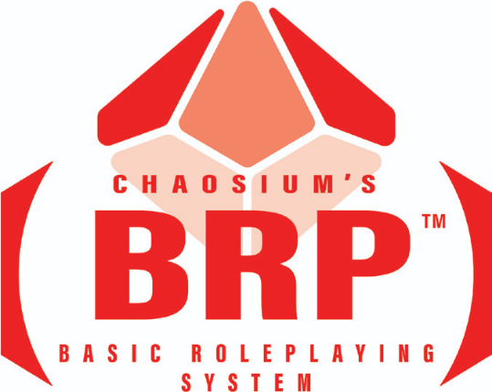

# 2D6 MCP — AI GM Assistant

SPDX-License-Identifier: AGPL-3.0-only
Copyright (C) 2026 Jupiter Industries (Liam Crowter) and the 2d6mcp maintainers

A system-agnostic Model Context Protocol (MCP) server providing a mechanical engine, dice roller, rules reference, and AI-powered rulings assistant for tabletop RPGs. Supports sci-fi (OGL/Cepheus Engine SRD), fantasy (Dungeon World, CC-BY-3.0), generic percentile (Basic Roleplaying SRD, BRP OGL v1.0), and d20 fantasy (5E-compatible SRD, CC-BY-4.0) games.

## Features

- **Dice Engine** — `2d6+1`, `3d6`, `d66`, target numbers, effect margins
- **OGL Rules Database** — Generated on first use from bundled seed data: Cepheus Engine SRD (OGL v1.0a)
- **Dungeon World Database** — Generated on first use from bundled seed data: moves, classes, spells, monsters, GM tools (CC-BY-3.0)
- **Basic Roleplaying Database** — Generated on first use from bundled seed data: BRP SRD 1.0.2 characteristics, skills, professions, weapons, armor, spot rules (BRP OGL v1.0)
- **5E-Compatible Database** — Generated on first use from bundled seed data: d20 fantasy SRD classes, spells, monsters, feats, and rules (CC-BY-4.0)
- **AI Rulings** — Ask rules questions, get cited answers from OGL/DW/BRP/5E-compatible/BYOD sources. Powered by local MLX or llama.cpp
- **Discord webhooks** — Post rulings and table output to Discord channels from the MCP server
- **BYOD Indexing** — Ingest your own PDF/text/markdown files for local full-text search
- **Session Management** — Start/end sessions, log transcripts, search what was said at the table
- **Local STT/LLM** — MLX on macOS; whisper.cpp and llama.cpp on Windows/Linux

## Quick Start

```bash
git clone https://github.com/crowterliam/2d6mcp.git
cd 2d6mcp
npm install
npm run build
npm run setup          # create consent token for BYOD mode
npm run populate-ogl   # generate the OGL rules database
npm run populate-dw    # generate the Dungeon World rules database
npm run populate-brp   # generate the Basic Roleplaying rules database
npm run populate-5ecompatible  # generate the 5E-compatible rules database
npm run start          # run the MCP server (stdio transport)
```

## MCP Client Configuration

```json
{
  "mcpServers": {
    "2d6mcp": {
      "command": "node",
      "args": ["/absolute/path/to/2d6mcp/packages/server/dist/index.js"],
      "env": {
        "AGREE_BYOD_USE": "true",
        "BYOD_PATH": "/path/to/your/rpg/files"
      }
    }
  }
}
```

## BYOD — Non-Commercial Use Disclosure

BYOD (Bring Your Own Documents) mode enables local file ingestion for personal, non-commercial use only. By enabling BYOD (`AGREE_BYOD_USE="true"` or `npm run setup`), you confirm that:

- You are the legal owner of the imported files or hold a valid license to use them.
- This tool is provided strictly for personal, non-commercial automation and referencing.
- The developers of this software do not condone piracy or the unauthorized distribution of copyrighted tabletop roleplaying materials.

## Tools

| Tool | Description |
|------|-------------|
| `roll` | Roll dice. `notation` plus optional `mechanic` (`2d6`, `d20`, `percentile`, `damage`, `raw`). Infers mechanic from notation when omitted. |
| `roll_table` | Roll on a named table. `source`: `ogl` or `byod`. Omit `table_name` with `source=byod` to list tables. |
| `query_rules` | Search a licensed rules DB. `system` required. Default category is core FTS only. `category=categories` lists filters. |
| `query_local_byod` | Search ingested personal files. Returns `chunkIndex`. Optional `include_full`. |
| `sync_byod` | Index BYOD files. Optional `relative_path` for a single file. |
| `clear_byod` | Delete the BYOD index. |
| `list_byod_files` | List indexed files. Optional `relative_path` inspects one file. |
| `get_byod_chunk` | Retrieve full chunk content by path + chunk index. |
| `parse_character` | Parse a character sheet into structured JSON |
| `discord_post` | Post messages to Discord webhooks with smart routing |
| `discord_webhook` | Manage webhooks: `action` add, remove, list, or test |
| `session` | Manage sessions: `action` start, end, list, delete, or summarize |
| `log_transcript` | Log a transcript segment to a session |
| `get_session_context` | Get recent transcript segments and rulings |
| `search_transcript` | Search session transcripts with SQL LIKE |
| `synthesize_ruling` | Cited rules ruling. Optional `from_context` uses recent transcript |
| `transcribe_audio` | Transcribe audio. Files over 180 seconds are chunked. Last chunk sets `complete: true` |

## Architecture

```
2d6mcp/
├── packages/
│   ├── server/          # MCP server — stdio transport, local MLX, BYOD, session DB
│   ├── shared/          # @2d6mcp/shared — dice, keywords, prompts, quality filter
│   ├── ogl/             # @2d6mcp/ogl — OGL rules database + queries
│   ├── dw/              # @2d6mcp/dw — DW rules database + queries
│   ├── brp/             # @2d6mcp/brp — BRP rules database + queries
│   ├── 5ecompatible/    # @2d6mcp/5ecompatible — 5E-compatible rules database + queries
│   └── orcus/           # @2d6mcp/orcus — Orcus d20-compatible rules database + queries
├── data/                # SQLite databases (shared)
├── tests/               # Vitest test suite
├── tsconfig.base.json
└── package.json         # npm workspaces root
```

## Agent Modes

This project includes AI agent instructions for common coding assistants. See `.kilo/agent/` for domain-specific modes:

| Agent File | Domain |
|-----------|--------|
| `.kilo/agent/2d6mcp.md` | Master reference — all tools, workflows, environment vars |
| `.kilo/agent/2d6mcp-task-resolution.md` | Dice rolling, effect margins, difficulty, boon/bane |
| `.kilo/agent/2d6mcp-rules-reference.md` | Rules lookup, table rolling, OGL + BYOD search |
| `.kilo/agent/2d6mcp-character-creation.md` | UPP, characteristics, career paths, skills |
| `.kilo/agent/2d6mcp-byod.md` | BYOD sync, listing, inspection, troubleshooting |

Slash commands are in `.kilo/command/` for quick access to common operations.

## Build & Test

```bash
npm install           # install all workspace dependencies
npm run build         # compile all packages (tsc --build)
npm test              # run the Vitest suite
npm run typecheck     # type-check without emitting
npm run start         # run the MCP server (packages/server/dist/index.js)
```

## Environment Variables

| Variable | Default | Description |
|----------|---------|-------------|
| `AGREE_BYOD_USE` | `"false"` | Set to `"true"` to enable BYOD mode |
| `BYOD_PATH` | — | Path to directory containing local RPG source files |
| `BYOD_CHUNK_SIZE` | `8000` | Characters per chunk (500–50000) |
| `BYOD_CHUNK_OVERLAP` | `400` | Overlap between consecutive chunks |
| `BYOD_MAX_FILES` | `2000` | Maximum files to process per sync |
| `BYOD_MAX_CHUNKS_PER_FILE` | `500` | Maximum chunks from any single file |
| `BYOD_SYNC_TIMEOUT_MS` | `15000` | Milliseconds per sync batch |
| `BYOD_CONTENT_CACHE_PATH` | `data/byod/content_cache.db` | Shared content cache database |
| `OGL_DB_PATH` | `data/ogl/cepheus.db` | Path to custom OGL SQLite database |
| `DW_DB_PATH` | `data/dw/dungeon-world.db` | Path to custom DW SQLite database |
| `BRP_DB_PATH` | `data/brp/basic-roleplaying.db` | Path to custom BRP SQLite database |
| `SR5E_DB_PATH` | `data/5ecompatible/5ecompatible-srd.db` | Path to custom 5E-compatible SQLite database |
| `ORCUS_DB_PATH` | `data/orcus/orcus.db` | Path to custom Orcus SQLite database |
| `MLX_WHISPER_MODEL` | `mlx-community/whisper-large-v3-turbo` | MLX Whisper model |
| `MLX_LLM_MODEL` | `mlx-community/Llama-3.2-3B-Instruct-4bit` | MLX LLM model |
| `SESSION_DB_PATH` | `~/.2d6mcp/sessions.db` | Session database location |
| `STT_BACKEND` | `mlx` | STT backend: `mlx` or `whispercpp` |
| `LLM_BACKEND` | `mlx` | LLM backend: `mlx` or `llamacpp` |

## License

This project uses a multi-license architecture:

- **Source code** (`packages/**`, root config files): [AGPL-3.0-only](https://www.gnu.org/licenses/agpl-3.0.en.html)
- **OGL game data** (`data/ogl/**`): [OGL v1.0a](OGL-1.0a.txt)
- **Dungeon World data** (`data/dw/**`): [CC-BY-3.0](data/dw/CC-BY-3.0.txt)
- **Basic Roleplaying data** (`data/brp/**`): [BRP Open Game License v1.0](data/brp/BRP-OGL-1.0.txt)
- **5E-compatible SRD data** (`data/5ecompatible/**`): [CC-BY-4.0](data/5ecompatible/SRD-NOTICE.txt)

The BRP logo (`BRP.png` in the project root and `data/brp/BRP.png`) is a trademark of Chaosium Inc., displayed in compliance with Section 15 of the BRP Open Game License v1.0.



You are granted permission to reproduce the logo only for the purpose of labeling derivative works under the BRP OGL.

Full license documentation: [LICENSE.md](LICENSE.md)

---

Copyright © 2026 Jupiter Industries (Liam Crowter) and the 2d6mcp maintainers
